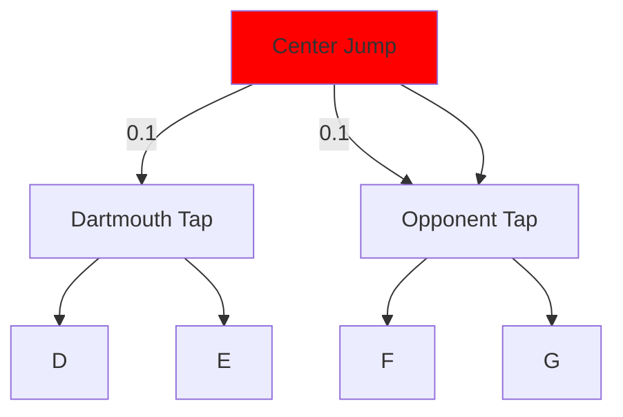

# BasketBall
BasketBall game, originally written in BASIC shortly after 1963

```mermaid 
graph TD;
    A[Center Jump]-->|0.1|B[Dartmouth Tap];
    A[Center Jump]-->|0.1|C[Opponent Tap];
    A-->C;
    B-->D;
    B-->E;
    C-->F;
    C-->G;

style A fill:#ff0000;

```

Hello
